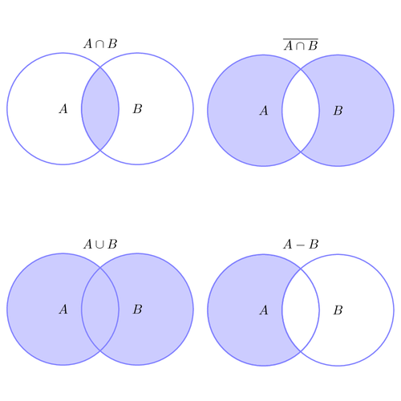

A set is a collection of distinct objects, considered as an object in its own right. For example, the numbers 2, 4, and 6 are distinct objects when considered separately, but when they are considered collectively they form a single set of size three, written {2, 4, 6}.

A set is a well-defined collection of distinct objects. The objects that make up a set (also known as the set's elements or members) can be anything: numbers, people, letters of the alphabet, other sets, and so on.

A = {2,4,6,8}

Element ∈

We can say that 2 is an element of the set A
2 ∈ A

ℕ is the set of natural numbers (positive integers). 2 is an element of the set of natural numbers
2 ∈ ℕ

The set of x where x is an element of the natural numbers and x is less then four:
{x | x ∈ ℕ, x < 4 } = {1,2,3}

The set of x where x is an element of the natural numbers and x is between 2 and 6:
{x | x ∈ ℕ, x > 2 AND x < 6 } = {3,4,5}

∪ Union
You can remember the ∪ symbol as the U in Union. A union performed on two sets will combine their elements into one set.

A   = {1,2,3}\
B   = {3,4,5}\
A ∪ B   = {1,2,3,4,5} 

   ∩ Intersection
The ∩ symbol for intersection resembles the n in intersection. An intersection of two sets A and B will be equal to a set of elements which can be found in both A and B.

A   = {1,2,3}\
B   = {3,4,5}\
A ∩ B   = {3} 

− Difference

Subtracting elements of one set from another. Symbol can also be /

A   = {1,2,3}\
B   = {3,4,5}\
A − B   = {1,2}    

⊕ Symmetric Difference
Can be seen as either subtracting the intersection from the union or alternatively; can be seen as subtracting A from B, then B from A.

A	= {1,2,3}\
B	= {3,4,5}\
A ⊕ B	= {1,2,4,5} 

⊂ Subset
What if all elements of set A were contained within set B? A set within a set? We would then call A the subset of B, and B the superset of A.

A	= {1,2,3}\
B	= {1,2,3,4,5}\
∴A⊂B

∁ Complement
A complement of A is a set of every element not in A.
A	={1,2,3}\
{x | x∈ℕ, x<10, x∈A∁} = {4,5,6,7,8,9}

Which is also the same as.
A	={1,2,3}\
{x | x∈ℕ, x<10, x∉A} = {4,5,6,7,8,9}
<!-- complement, not of A, but less than 10 -->

